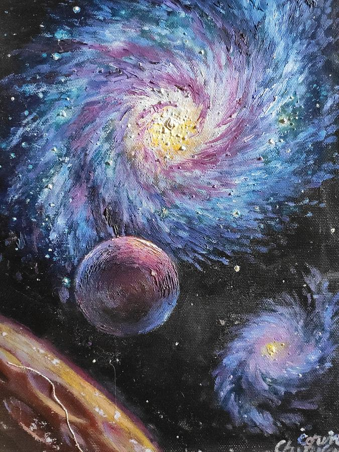
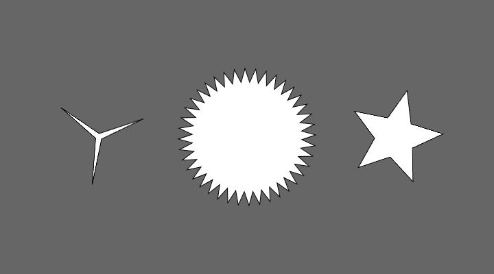

# zhsu0843_9103_tut5

# Part 1: Imaging Technique Inspiration

I think these two works give me a lot of inspiration. They both seem to contain an element of rotation, so when I gaze at these two works, they give me a sense of being gradually brought into the picture by gravity. So, I think this kind of rotation or distortion is a good element, and I want to use it to make a very dynamic piece.

## Part 2: Coding Technique Exploration

I found a technique in **p5.js** that allows a graph to continuously rotate. I think this technique can assist my idea to make the elements of the picture dynamic, which will enhance the tension of the picture.

[coding exmple](https://p5js.org/examples/form-star.html
)

