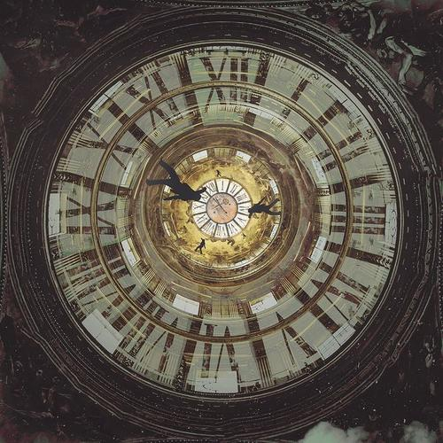

# zhsu0843_9103_tut5
My first repository for IDEA9103

This is my first local change to the repo!

# Part 1: Imaging Technique Inspiration




**Bold Text** or __Bold Text__

## Part 2: Coding Technique Exploration


**Bold Text** or __Bold Text__
*Italic Text* or _Italic Text_

- Item 1
- Item 2
  - Subitem 2.1
  - Subitem 2.2

1. First Item
2. Second Item
3. Third Item

[coding exmple](https://p5js.org/examples/form-star.html
Links to an external site.)


```
function helloWorld() {
console.log("Hello, world!");
}
```

> This is a blockquote.


